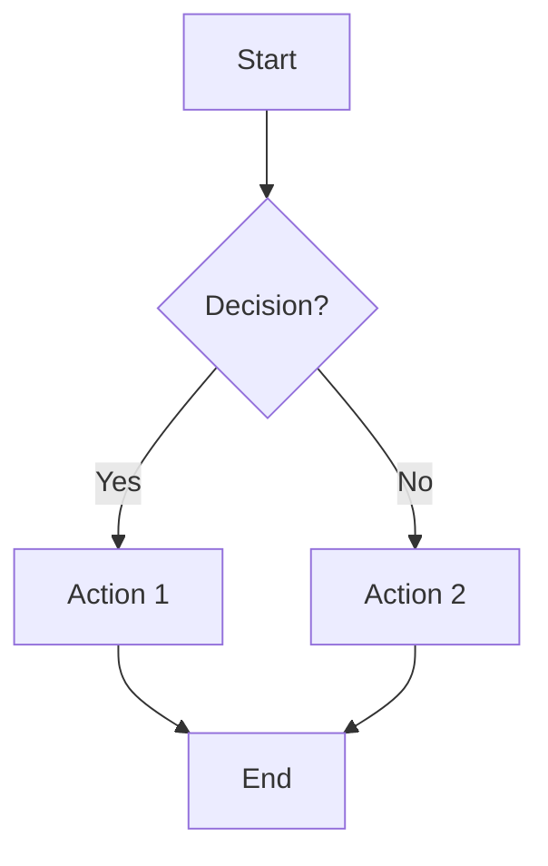
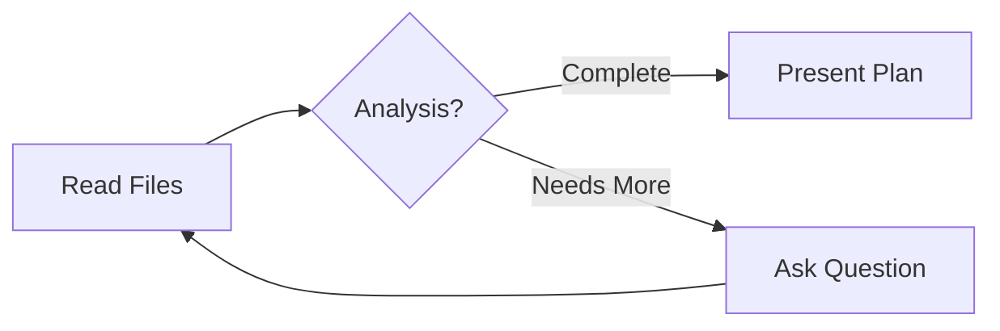

# Mermaid Diagram Guidelines for PLAN MODE

**Objective:** Improve clarity and user comprehension by leveraging visual representations when planning complex solutions. This rule guides when and how to use Mermaid diagrams in `plan_mode_respond` responses.

## When to Include Mermaid Diagrams

**SHOULD** include a Mermaid code block when:
- Plan involves multiple interconnected steps or decisions
- Complex workflows or data flows need clarification
- System architecture or component relationships are key to understanding
- Process dependencies could benefit from visual representation

**MUST** include a Mermaid diagram when:
- Plan has 4+ sequential or parallel steps
- Decision trees or conditional logic are involved
- User needs to see system/component interactions
- Visual hierarchy would accelerate understanding significantly

## Best Practices for Diagram Creation

### High-Contrast Colors (⚠️ CRITICAL)
**MUST** use high-contrast colors for text readability:
- **GOOD:** Default styles (dark text on light background)
- **GOOD:** `fill:#000, color:#fff` (white text on black)
- **AVOID:** 🔴 Low-contrast like `fill:#fff, color:#ff0000` (red on white)

### Visual Hierarchy & Aesthetics (📊)
**MUST** aim for clarity and aesthetic appeal:
- Use logical shapes: rectangles for processes, diamonds for decisions
- Maintain consistent spacing and alignment
- Use descriptive, concise labels
- Limit nodes to 10-15 for readability

### Code Block Formatting (💻)
**MUST** enclose in triple backticks with `mermaid` language identifier:
```

```

## Diagram Types by Context
| Type | Use Case | Example Syntax |
|------|----------|---------------|
| Flowchart | Processes/workflows | `flowchart TD` |
| Sequence | Interactions over time | `sequenceDiagram` |
| ER | Data models | `erDiagram` |
| Gantt | Timelines | `gantt` |

## Example Usage in Plan Mode Response
```
Here's the planned workflow:


```

**Verification:** Before finalizing plan_mode_respond, check if diagram would make structure clearer. If yes, include it.

**Note:** Diagrams enhance UX; use judiciously to avoid overcomplication.
